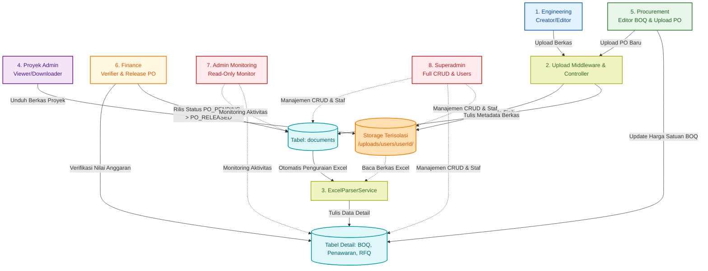

# Project Document Collaboration ERP System

Sistem ERP berbasis web untuk kolaborasi dokumen proyek konstruksi (Gambar Teknis, BOQ, Penawaran, RFQ). Sistem ini mendukung folder penyimpanan fisik terisolasi untuk masing-masing user, otomatisasi parsing berkas Excel (BOQ, Penawaran, RFQ) langsung ke database PostgreSQL, revisi harga satuan BOQ oleh Procurement, pemantauan total anggaran oleh Finance, serta log audit dan pengawasan terpusat bagi Admin Monitoring dan Superadmin.

---

## 🗺️ Flowmap Alur Kerja & Distribusi Dokumen Proyek

Berikut adalah visualisasi alur kerja kolaborasi proyek, penguraian file Excel, dan hak akses multi-role (termasuk Admin Monitoring & Superadmin):



### 📋 Tabel Rincian Peran & Fungsi Pengguna (Role Matrix)

| Pengguna / Peran (Role) | Hak Akses (Access Control) | Fungsi & Tanggung Jawab Utama |
| :--- | :--- | :--- |
| **Engineering** | CRUD milik sendiri | - Mengunggah berkas Gambar Teknis.<br>- Mengunggah Penawaran Vendor (Excel + PDF) melalui Form Modal.<br>- Mengunggah berkas BOQ & RFQ (Excel).<br>- Hanya dapat memanipulasi berkas di folder terisolasi miliknya sendiri. |
| **Proyek Admin** | Read-Only | - Melihat daftar seluruh berkas proyek aktif.<br>- Mengunduh seluruh berkas proyek lapangan.<br>- **Tidak memiliki hak akses** untuk mengubah data, menambah proyek, atau menghapus berkas. |
| **Procurement** | Read + Edit BOQ & PO | - Melihat daftar berkas proyek.<br>- Membuka tab evaluasi dan mengubah kolom harga satuan aktual (`rateProcurement`) di berkas BOQ.<br>- Memberikan catatan detail (*notes*) negosiasi item pekerjaan.<br>- Mengunggah berkas Purchase Order (PO) baru yang otomatis berstatus `PO_PENDING`. |
| **Finance** | Read-Only + Release PO | - Memverifikasi nilai penawaran vendor melalui pop-up modal detail hasil pembacaan Excel.<br>- Memantau total nilai akhir anggaran BOQ yang telah disesuaikan oleh Procurement.<br>- Melakukan verifikasi dan rilis berkas Purchase Order (PO), mengubah statusnya dari `PO_PENDING` menjadi `PO_RELEASED`. |
| **Admin (Monitoring)** | Read-Only Global | - Memantau seluruh direktori penyimpanan fisik pengguna.<br>- Memantau seluruh isi tabel transaksi database.<br>- Memantau kronologi log audit sistem global.<br>- **Tidak memiliki tombol/fitur** untuk mengubah, menambah, atau menghapus data (Sistem Terkunci). |
| **Superadmin** | Full CRUD | - Manajemen akun staf (mendaftarkan user baru & mengatur role).<br>- Akses penuh CRUD (Create, Read, Update, Delete) pada seluruh data proyek dan file fisik.<br>- Memantau riwayat log audit aktivitas.<br>- Melakukan override/koreksi data jika terjadi kesalahan operasional staf. | staf. |

### Penjelasan Detil Alur Kerja Proyek (Step-by-Step):

1. **Tahap 1 (Unggah File oleh Engineering)**:
   * **Langkah 1**: Staf *Engineering* mengirim berkas Gambar Teknis atau berkas spreadsheet Excel (BOQ, Penawaran, RFQ) melalui form antarmuka web.
   * **Langkah 2**: Server Express menangkap berkas melalui middleware `multer`. Multer mendeteksi uploader ID dan jenis dokumen untuk diletakkan ke folder terisolasi di disk server (`/storage/uploads/users/{user_uuid}/{file_type}/`).
   * **Langkah 3**: Metadata berkas (seperti nama file, path fisik, tipe, ukuran, pengunggah) disimpan ke tabel `documents` dengan status awal `PENDING`.

2. **Tahap 2 (Otomatisasi Parsing Excel ke Database)**:
   * **Langkah 4**: Jika berkas yang diunggah berupa Excel (.xlsx / .xls), sistem memanggil `ExcelParserService`.
   * **Langkah 5a, 5b, 5c**: Layanan pengurai akan membuka lembar kerja Excel dan memindahkan isinya ke dalam baris-baris tabel database secara terstruktur:
     * File **BOQ** dimasukkan ke tabel `boq_headers` dan baris detailnya ke `boq_items`.
     * File **Penawaran** dimasukkan ke tabel `penawaran_headers` dan detail barang ke `penawaran_items` (disertai nama vendor & masa berlaku dari input form modal).
     * File **RFQ** dimasukkan ke tabel `rfq_headers` dan detail penawaran ke `rfq_items`.

3. **Tahap 3 (Pengendalian oleh Proyek Admin)**:
   * **Langkah 6**: Staf *Proyek Admin* memantau daftar semua berkas proyek melalui tabel Documents Explorer yang mengambil data dari tabel `documents`.
   * **Langkah 7**: Ketika tombol *Download* ditekan, server memverifikasi sesi lalu menyuplai kembali berkas fisik dari folder terisolasi pengguna bersangkutan agar dapat diunduh ke browser.

4. **Tahap 4 (Evaluasi Harga Satuan oleh Procurement)**:
   * **Langkah 8**: Staf *Procurement* membuka tab evaluasi BOQ untuk melihat rincian item pekerjaan di tabel `boq_items` yang diupload Engineering.
   * **Langkah 9**: Procurement dapat memperbarui kolom `rateProcurement` (harga satuan deal negosiasi) dan menambahkan catatan (*notes*) negosiasi langsung di dalam tabel.
   * **Langkah 10**: Server secara otomatis menghitung ulang `totalPrice` item (`quantity` * `rateProcurement`), mengakumulasi total akhir di tabel `boq_headers` (`totalAmount`), serta mengubah status dokumen menjadi `REVISED_BY_PROCUREMENT`.

5. **Tahap 5 (Verifikasi Keuangan oleh Finance)**:
   * **Langkah 11**: Staf *Finance* dapat melihat dokumen penawaran dalam bentuk popup modal yang berisi data terurai vendor (`penawaran_items` seperti kuantitas, harga, total sub).
   * **Langkah 12**: Finance memonitor total nilai BOQ (`totalAmount` dari `boq_headers`) yang telah disesuaikan oleh Procurement untuk menyinkronkan anggaran pembayaran.

6. **Tahap Pengawasan & Audit Trail (Admin Monitoring & Superadmin)**:
   * Setiap aktivitas penting (seperti unggah berkas, unduh berkas, ubah harga BOQ, hapus berkas) dicatat ke dalam tabel `audit_logs`.
   * **Langkah 13a**: Pengguna ber-role **Admin (Monitoring)** diberikan dashboard khusus untuk memantau data proyek, seluruh berkas, serta tabel audit log secara *Read-Only* (tidak bisa memanipulasi data).
   * **Langkah 13b**: Pengguna ber-role **Superadmin** memiliki akses kontrol mutlak (CRUD) pada semua data proyek, dokumen fisik di server, tabel database, serta penambahan akun pengguna baru.

---

## 📂 Struktur Direktori Proyek

```text
assetmenagemen/
├── backend/                  # REST API & Database Service (Express)
│   ├── prisma/
│   │   ├── schema.prisma     # Skema Database PostgreSQL (Prisma ORM)
│   │   └── seed.ts           # Seeding Data Awal (Admin, Staff, Aset, Log)
│   ├── src/
│   │   ├── config/           # Konfigurasi Database Koneksi
│   │   ├── controllers/      # Logika Request & Response Handler
│   │   ├── middlewares/      # Validasi Skema & Autentikasi JWT
│   │   ├── routes/           # Routing Endpoint API
│   │   ├── services/         # Logika Bisnis & PDFKit Report Service
│   │   └── utils/            # Utilitas Notifikasi & Error Helper
│   ├── .env                  # Konfigurasi Environment (Port, DB, API Token)
│   ├── tsconfig.json         # Konfigurasi TypeScript Compiler
│   └── package.json
│
├── frontend/                 # User Interface (Next.js & Tailwind CSS)
│   ├── src/
│   │   ├── app/              # Struktur Halaman Utama (App Router)
│   │   │   ├── (dashboard)/  # Halaman Dashboard, Aset, Kategori, Riwayat, Kelola Staf
│   │   │   ├── login/        # Halaman Login
│   │   │   └── layout.tsx
│   │   ├── lib/              # Konfigurasi AuthContext & Axios Client API
│   │   └── types/            # Type Definition TypeScript
│   ├── public/               # Asset Statis (Gambar, Icon)
│   └── package.json
│
└── .gitignore                # Pengecualian Git Root (Melindungi .env & node_modules)
```

---

## ⚙️ Cara Instalasi & Konfigurasi

### 1. Prasyarat Sistem
* **Node.js** (Versi 18 ke atas)
* **PostgreSQL** (Berjalan di port default `5432`)

---

### 2. Langkah Setup Backend
1. Masuk ke folder backend:
   ```bash
   cd backend
   ```
2. Instal semua dependensi Node.js:
   ```bash
   npm install
   ```
3. Buat atau sesuaikan file `.env` di dalam folder `backend`:
   ```env
   PORT=5000
   DATABASE_URL="postgresql://<user>:<password>@localhost:5432/<db_name>?schema=public"
   JWT_SECRET="GantiDenganSecretKeyJWTAnda"
   
   # Konfigurasi Telegram Bot (Dapatkan dari @BotFather)
   TELEGRAM_BOT_TOKEN="TOKEN_BOT_TELEGRAM_ANDA"
   TELEGRAM_CHAT_ID="ID_CHAT_TELEGRAM_ANDA"
   
   # Konfigurasi WhatsApp Fonnte (Dapatkan dari fonnte.com)
   WHATSAPP_API_URL="https://api.fonnte.com/send"
   WHATSAPP_TOKEN="TOKEN_API_FONNTE_ANDA"
   WHATSAPP_TARGET_NUMBER="628xxxxxxxxxx"
   
   # Konfigurasi Google Sheets (Apps Script Web App URL)
   GOOGLE_SHEET_WEBHOOK_URL="https://script.google.com/macros/s/XXXXX/exec"
   ```
4. Jalankan migrasi skema database Prisma:
   ```bash
   npm run prisma:migrate
   ```
5. Masukkan data awal (seeding) untuk akun default:
   ```bash
   npx prisma db seed
   ```

---

### 3. Langkah Setup Frontend
1. Masuk ke folder frontend:
   ```bash
   cd ../frontend
   ```
2. Instal semua dependensi Node.js:
   ```bash
   npm install
   ```

---

## 🚀 Cara Menjalankan Aplikasi

Aplikasi harus dijalankan menggunakan **dua terminal terpisah**:

* **Terminal 1 (Backend)**:
  ```bash
  cd backend
  npm run dev
  ```
  *Server backend akan berjalan di **http://localhost:5000***

* **Terminal 2 (Frontend)**:
  ```bash
  cd frontend
  npm run dev
  ```
  *Aplikasi web frontend akan berjalan di **http://localhost:3000***

---

## 🔑 Akun Default untuk Pengujian (Login)
Setelah melakukan database seeding (`npx prisma db seed`), Anda dapat masuk dengan salah satu dari 6 akun peran bawaan berikut:

* **Staf Engineering** (Upload Berkas):
  * **Email**: `engineering@project.com`
  * **Password**: `eng123`
* **Staf Proyek Admin** (View & Download):
  * **Email**: `proyekadmin@project.com`
  * **Password**: `proyek123`
* **Staf Procurement** (Edit Harga BOQ):
  * **Email**: `procurement@project.com`
  * **Password**: `proc123`
* **Staf Finance** (View Penawaran Modal & BOQ Total):
  * **Email**: `finance@project.com`
  * **Password**: `fin123`
* **Admin Monitoring** (Pengawasan Read-Only):
  * **Email**: `adminmon@project.com`
  * **Password**: `mon123`
* **Super Administrator** (Akses CRUD Lengkap):
  * **Email**: `superadmin@project.com`
  * **Password**: `super123`

---

## 📊 Integrasi Google Spreadsheet
Aplikasi ini mendukung pencatatan perubahan data aset ke Google Spreadsheet secara real-time.

### Cara Integrasi:
1. Buka spreadsheet Anda, lalu pilih **Ekstensi (Extensions)** -> **Apps Script**.
2. Masukkan kode berikut ke dalam `Code.gs` dan simpan:
   ```javascript
   function doPost(e) {
     try {
       var data = JSON.parse(e.postData.contents);
       var sheet = SpreadsheetApp.getActiveSpreadsheet().getActiveSheet();
       if (sheet.getLastRow() === 0) {
         sheet.appendRow(["Tanggal & Waktu", "Aksi", "Nama Aset", "SKU Code", "Status", "Lokasi", "Harga", "Oleh"]);
       }
       sheet.appendRow([
         data.timestamp || new Date().toLocaleString("id-ID"),
         data.actionType,
         data.assetName,
         data.skuCode,
         data.status,
         data.location,
         data.price,
         data.updaterName
       ]);
       return ContentService.createTextOutput(JSON.stringify({ status: "success" })).setMimeType(ContentService.MimeType.JSON);
     } catch (error) {
       return ContentService.createTextOutput(JSON.stringify({ status: "error", message: error.toString() })).setMimeType(ContentService.MimeType.JSON);
     }
   }
   ```
3. Klik **Deploy** -> **New deployment**.
4. Pilih tipe **Web app**, atur **Execute as** ke *Me (Saya)*, dan **Who has access** ke *Anyone (Siapa saja)*.
5. Jalankan deploy, salin Web App URL yang dihasilkan, dan tempelkan ke variabel `GOOGLE_SHEET_WEBHOOK_URL` di file `.env` backend.
6. Restart backend Anda.
