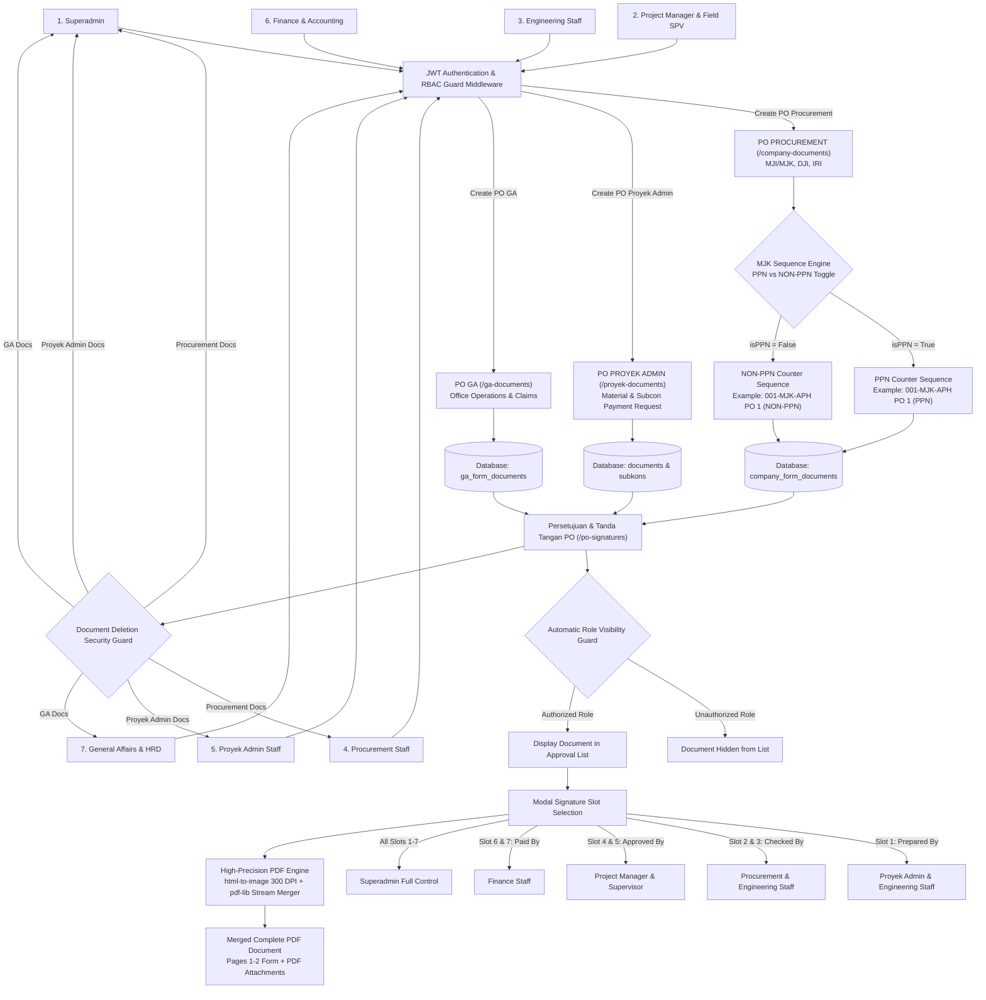
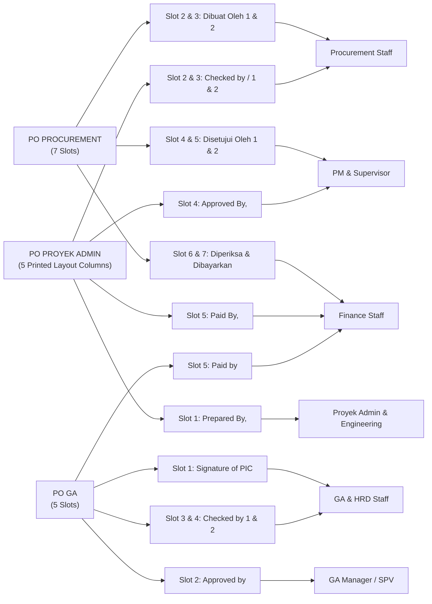
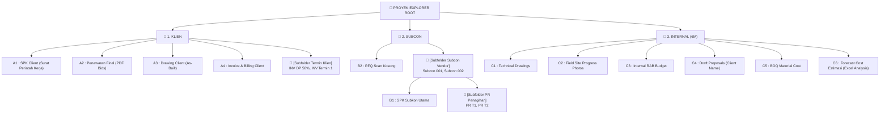

# PT. MODERN JAYA KONSTRUKSI — Enterprise Asset Management & Digital Construction ERP System

> **Documentation Version:** 3.5.0-PROD  
> **License & Copyright:** © 2026 PT. Modern Jaya Konstruksi. All Rights Reserved.  
> **Architecture:** Next.js 16 (App Router + Turbopack) + Express.js TypeScript API + PostgreSQL Prisma ORM  

---

## 📌 Executive Summary

The **Enterprise Asset Management & Digital Construction ERP System** of **PT. Modern Jaya Konstruksi** is engineered specifically to integrate end-to-end operational workflows for construction projects. The application seamlessly combines a 3-tier whiteboard folder management hierarchy (**Whiteboard Hierarchy A1-C6**), multi-role Purchase Order (PO) creation and approval modules (**PO Procurement**, **PO Proyek Admin**, **PO GA**), independent sequence engines for PPN & Non-PPN POs, a 24-column Subcontractor tracking system, a 19-column Finance cashflow dashboard, GPS geotagging selfie attendance, and a high-precision PDF rendering and merging engine (`html-to-image` 300 DPI + `pdf-lib`).

---

## 🗺️ 1. Master System Architecture & Operational Flowmaps

### A. End-to-End Master Operational Flowmap



---

### B. Precision Signature Slot Mapping Flowchart (1-to-1 Mapping)



---

### C. 3-Tier Whiteboard File Explorer Hierarchy



---

## 🛠️ 2. Technology Stack & Technical Specifications

### A. Frontend Tier
- **Framework:** Next.js 16 (App Router Architecture, Turbopack Bundler)
- **UI & Styling:** TailwindCSS v3, Lucide React Icons, Dynamic Dark Mode & CSS Glassmorphism
- **PDF & Canvas Rendering:** `html-to-image` (DOM HTML to Canvas 300 DPI) + `pdf-lib` (Binary PDF stream merger & manipulation)
- **State Management & Realtime:** React State/Context, Custom Hooks, `BroadcastChannel` API for cross-tab browser sync

### B. Backend Tier
- **Runtime Environment:** Node.js v20 LTS
- **Server Framework:** Express.js REST API with TypeScript
- **File Storage Processing:** Multer Disk Storage Engine with filename sanitization & extension validation
- **Authentication & Security:** JWT (JSON Web Tokens) with `HS256` encryption, `bcryptjs` password hashing, CORS protection, Express Rate Limiting

### C. Database Tier
- **Database Engine:** PostgreSQL 15 Engine
- **ORM Client:** Prisma ORM 5+ with Type-Safe Query Builder
- **Migrations & Seeding:** Prisma Schema Migrations & Automated Seed Engine (`prisma/seed.ts`)

---

## 📑 3. Core Modules & Business Logic Details

### 1. PO PROCUREMENT Module (`/company-documents`)
- **Function:** Manages Purchase Orders for materials, equipment, and subcontractor services across PT. Modern Jaya Konstruksi (**MJK/MJI**), PT. Delta Jaya Indotama (**DJI**), and PT. Indotama Ranah Industri (**IRI**).
- **Independent PPN vs NON-PPN Numbering Sequence Engine:**
  The system executes a custom sequence engine separating PPN and NON-PPN PO counters per project:
  - PO PPN: Format `[SEQ]/[CO]/[ROMAN_MONTH]/[YEAR]` labeled as `PO 1 (PPN)`, `PO 2 (PPN)`.
  - PO NON-PPN: Format `[SEQ]/[CO]/[ROMAN_MONTH]/[YEAR]` labeled as `PO 1 (NON-PPN)`, `PO 2 (NON-PPN)`.
- **Priority Indicator:** Enforces strict visual badges: **Urgent (Red)** or **Normal (Green)**.
- **7 Signature Slots:** Slot 2-3 (Procurement), Slot 4-5 (PM/SPV), Slot 6-7 (Finance).

### 2. PO PROYEK ADMIN Module (`/proyek-documents`)
- **Function:** Manages material & subcontractor *Payment Requests*.
- **Master Data Integration:** Linked directly to Master Project Codes, Master Clients, and Master Subcontractors.
- **Read-Only PO Total:** Total price is computed automatically from item subtotal + PPN to prevent manual tampering.
- **5-Column Printed Layout:** Prepared By (Col 1), Checked 1 (Col 2), Checked 2 (Col 3), Approved By (Col 4), Paid By (Col 5).

### 3. PO GENERAL AFFAIRS / GA Module (`/ga-documents`)
- **Function:** Operational expense claims, office utilities, stationery, fleet maintenance, and office inventory.
- **5 Signature Slots:** Slot 1 (PIC GA), Slot 2 (Approved GA Mgr/SPV), Slot 3-4 (Checked GA/Finance), Slot 5 (Paid Finance).

### 4. PO Approval & Signature Hub (`/po-signatures`)
- **Automatic Visibility Guard:** Filters document listings according to logged-in user role. Users only see documents requiring their authorization.
- **Document Deduplication:** Deduplicates records using unique document IDs (`t.id === doc.id`), ensuring distinct PO PPN and PO NON-PPN sharing PR numbers remain accessible.
- **Precision Candidate Matching:** Candidate selection dropdowns auto-match logged-in user credentials with authorized system staff.

---

## 📊 4. Data Matrices & Tracking Systems

### A. Subcontractor Tracking Matrix 2 (24 Operational Columns)
1. `No` — Row index
2. `Subcon Name` — Subcontractor vendor name
3. `Work Scope` — Description of work items
4. `Subcon SPK No` — Subcontractor contract number
5. `Contract Value` — Initial SPK value
6. `Addendum / VO` — Variation Order value adjustments
7. `Final Contract Total` — SPK Value + Addendums
8. `Term 1 (DP)` — Down payment amount
9. `Term 2 (Progress 1)` — First progress payment amount
10. `Term 3 (Progress 2)` — Second progress payment amount
11. `Term 4 (Retention)` — Maintenance retention payment amount
12. `Total Subcon Invoiced` — Total billed amount to date
13. `Remaining Balance` — Remaining contract balance
14. `Payment Status` — Badge status (Paid / Outstanding)
15. `Tax Invoice` — Tax invoice reference & file
16. `BAST Receipt` — Handover certificate receipt
17. `Progress Remarks` — Physical field progress notes
18. `SPK File` — Uploaded PDF SPK Contract
19. `Invoice File` — Uploaded PDF Vendor Invoice
20. `Tax File` — Uploaded PDF Tax Certificate
21. `Submission Date` — Date invoice received
22. `Paid Date` — Date payment released
23. `PIC Verifier` — Staff verifier name
24. `Revision Notes` — Administrative correction notes

### B. Finance Cashflow Dashboard Matrix (19 Billing Columns)
1. `Project Code` — Unique project identifier
2. `Client Name` — Client organization name
3. `Project Name` — Construction project title
4. `Contract Value` — Total Client SPK Contract value
5. `Contract Start` — Project commencement date
6. `Timeline` — Planned execution duration
7. `Contract End` — Target completion date
8. `Project Status` — Running / Finished / Maintenance
9. `Physical Progress (%)` — Certified physical progress percentage
10. `Total BOQ` — Allocated BOQ budget
11. `Total Invoice` — Cumulative invoices issued
12. `Term` — Payment stage
13. `Term Value` — Stage invoice amount
14. `PPH (%)` — Income Tax deduction percentage
15. `Grand Total (Nett)` — Net payment payable
16. `Billing Status` — Outstanding / Paid / Partial
17. `Remarks` — Finance admin notes
18. `Field Issues` — Billing bottlenecks
19. `Payment Remarks` — Bank transaction reference

---

## 🗄️ 5. Complete Relational Database Schema (Prisma DDL)

```prisma
// File: backend/prisma/schema.prisma

datasource db {
  provider = "postgresql"
  url      = env("DATABASE_URL")
}

generator client {
  provider = "prisma-client-js"
}

enum Role {
  SUPERADMIN
  PROJECT_MANAGER
  SUPERVISOR
  ENGINEERING
  PROCUREMENT
  PROYEK_ADMIN
  FINANCE
  GA
  STAFF_GA
  HRD
}

model User {
  id        String   @id @default(uuid())
  email     String   @unique
  name      String
  password  String
  role      Role     @default(PROYEK_ADMIN)
  managerId String?
  createdAt DateTime @default(now())
  updatedAt DateTime @updatedAt
}

model Project {
  id           String     @id @default(uuid())
  kodeProyek   String     @unique
  namaProyek   String
  namaClient   String
  nilaiKontrak Float
  awalKontrak  DateTime?
  akhirKontrak DateTime?
  status       String     @default("Running")
  documents    Document[]
  subkons      Subkon[]
  createdAt    DateTime   @default(now())
  updatedAt    DateTime   @updatedAt
}

model CompanyFormDocument {
  id           String   @id @default(uuid())
  company      String
  documentNo   String   @unique
  poNo         String?
  vendorName   String?
  documentData Json
  signatures   Json?
  status       String   @default("PENDING")
  createdAt    DateTime @default(now())
  updatedAt    DateTime @updatedAt
}

model GaFormDocument {
  id           String   @id @default(uuid())
  company      String
  documentNo   String   @unique
  documentData Json
  signatures   Json?
  status       String   @default("PENDING")
  createdAt    DateTime @default(now())
  updatedAt    DateTime @updatedAt
}

model Document {
  id          String   @id @default(uuid())
  projectId   String
  project     Project  @relation(fields: [projectId], references: [id], onDelete: Cascade)
  code        String
  name        String
  filePath    String
  fileType    String
  fileSize    Int
  createdById String?
  createdAt   DateTime @default(now())
  updatedAt   DateTime @updatedAt
}

model Subkon {
  id           String        @id @default(uuid())
  projectId    String
  project      Project       @relation(fields: [projectId], references: [id], onDelete: Cascade)
  namaSubkon   String
  pekerjaan    String
  noSpk        String?
  nilaiKontrak Float
  termins      SubkonTermin[]
  createdAt    DateTime      @default(now())
  updatedAt    DateTime      @updatedAt
}

model SubkonTermin {
  id           String   @id @default(uuid())
  subkonId     String
  subkon       Subkon   @relation(fields: [subkonId], references: [id], onDelete: Cascade)
  namaTermin   String
  nilaiTermin  Float
  status       String   @default("PENDING")
  createdAt    DateTime @default(now())
  updatedAt    DateTime @updatedAt
}

model Attendance {
  id        String   @id @default(uuid())
  userId    String
  userName  String
  userRole  String
  date      String
  time      String
  type      String   // IN / OUT
  photoUrl  String
  latitude  Float?
  longitude Float?
  address   String?
  createdAt DateTime @default(now())
}

model WorkReport {
  id          String   @id @default(uuid())
  userId      String
  userName    String
  userRole    String
  date        String
  description String
  progress    Int      @default(0)
  createdAt   DateTime @default(now())
}
```

---

## 🔒 6. User Role Authorization Matrix (7 Divisions + Superadmin)

| Division / Role | PO Signatures Access (`/po-signatures`) | PO Form Access | Deletion Authority | Explorer & Core Feature Access |
| --- | --- | --- | --- | --- |
| **SUPERADMIN** | Slot 1 - 7 (Full Authority) | All PO Forms | All Documents | Full CRUD, User Management, Audit Logs, System Settings |
| **PROJECT_MANAGER** | Slot 4 & 5 (Approved By) | View & Verify | Restricted | BOQ Authorization, Project Progress Tracking, Work Reports |
| **SUPERVISOR** | Slot 4 & 5 (Approved By) | View & Verify | Restricted | Physical Progress Verification, Field Form Approvals |
| **ENGINEERING** | Slot 1 & 3 (Prepared / Checked) | Restricted | Restricted | Global Explorer File Search, C1 Drawings, A1 Client SPK, C3 RAB |
| **PROCUREMENT** | Slot 2 & 3 (Dibuat / Checked) | PO Procurement Form | Procurement Docs | C5 BOQ Rate Evaluation, PO Procurement Form, RFQ Matrix |
| **PROYEK_ADMIN** | Slot 1 (Prepared By) | PO Proyek Admin Form | Proyek Admin Docs | PO Proyek Admin Form, Subcon Tracking Matrix (24 Columns) |
| **FINANCE** | Slot 5, 6, 7 (Diperiksa / Paid) | View & Payment | Restricted | Finance Dashboard (19 Columns), Payment Release, Payment Proof Upload |
| **GA / HRD** | Slot 1, 3, 4, 5 (GA PO) | PO GA Form | GA Docs | PO GA Form (`/ga-documents`), GPS Geotagging Attendance, Daily Work Reports |

---

## 💻 7. Installation & Offline Office LAN Server Deployment Guide

### A. Backend API Setup
```bash
# Navigate to backend directory
cd backend
npm install
npx prisma db push
npx prisma db seed
npm run dev
```

### B. Frontend App Setup
```bash
# Navigate to frontend directory
cd frontend
npm install
npm run dev
```

### C. Default Server Endpoints
- **Frontend Web App**: `http://localhost:3000` (or LAN IP `http://192.168.1.16:3000`)
- **Backend API Server**: `http://localhost:5000`

---

## 🔑 8. Test Accounts & Default Seed Credentials

| User Role | Email Address | Default Password | Division |
| --- | --- | --- | --- |
| **Superadmin** | `superadmin@project.com` | `super123` | Management |
| **Project Manager** | `pm@project.com` | `pm123` | Operations |
| **Supervisor** | `spv@project.com` | `spv123` | Field Operations |
| **Engineering** | `engineering@project.com` | `eng123` | Engineering |
| **Procurement** | `procurement@project.com` | `proc123` | Logistics & Sourcing |
| **Proyek Admin** | `proyekadmin@project.com` | `proyek123` | Project Administration |
| **Finance** | `finance@project.com` | `fin123` | Finance & Accounting |
| **GA Staff** | `ga@project.com` | `ga123` | General Affairs |

---

© 2026 **PT. Modern Jaya Konstruksi** — Enterprise Digital Construction ERP System. All Rights Reserved.
