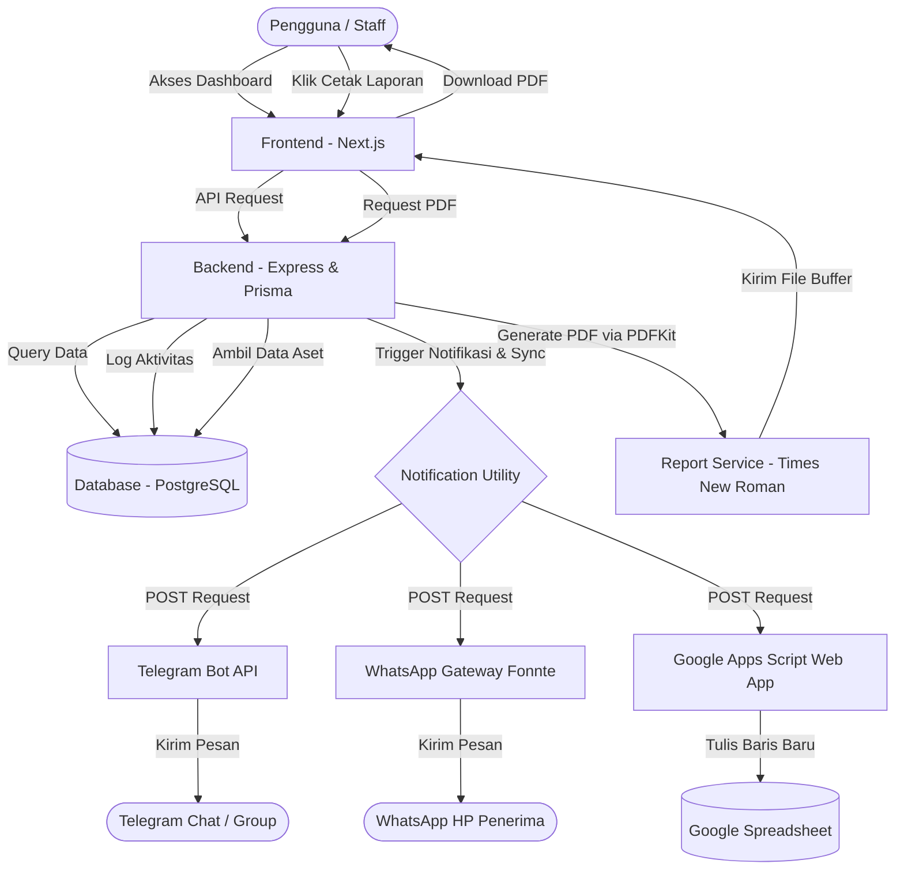

# Asset Management System (ERP)

Sistem ERP berbasis web untuk manajemen aset perusahaan. Sistem ini mencakup pencatatan inventori barang, lokasi, status operasional (tersedia, digunakan, pemeliharaan, diarsipkan), nilai penyusutan aset (depresiasi), pencetakan laporan PDF, serta integrasi notifikasi real-time ke WhatsApp, Telegram, dan sinkronisasi otomatis ke Google Spreadsheet.

---

## 🗺️ Flowmap & Arsitektur Sistem

Berikut adalah alur data dan interaksi antara pengguna, aplikasi, database, dan integrasi pihak ketiga:



---

## 📂 Struktur Direktori Proyek

```text
assetmenagemen/
├── backend/                  # REST API & Database Service (Express)
│   ├── prisma/
│   │   ├── schema.prisma     # Skema Database PostgreSQL (Prisma ORM)
│   │   └── seed.ts           # Seeding Data Awal (Admin, Staff, Aset, Log)
│   ├── src/
│   │   ├── config/           # Konfigurasi Database Koneksi
│   │   ├── controllers/      # Logika Request & Response Handler
│   │   ├── middlewares/      # Validasi Skema & Autentikasi JWT
│   │   ├── routes/           # Routing Endpoint API
│   │   ├── services/         # Logika Bisnis & PDFKit Report Service
│   │   └── utils/            # Utilitas Notifikasi & Error Helper
│   ├── .env                  # Konfigurasi Environment (Port, DB, API Token)
│   ├── tsconfig.json         # Konfigurasi TypeScript Compiler
│   └── package.json
│
├── frontend/                 # User Interface (Next.js & Tailwind CSS)
│   ├── src/
│   │   ├── app/              # Struktur Halaman Utama (App Router)
│   │   │   ├── (dashboard)/  # Halaman Dashboard, Aset, Kategori, Riwayat, Kelola Staf
│   │   │   ├── login/        # Halaman Login
│   │   │   └── layout.tsx
│   │   ├── lib/              # Konfigurasi AuthContext & Axios Client API
│   │   └── types/            # Type Definition TypeScript
│   ├── public/               # Asset Statis (Gambar, Icon)
│   └── package.json
│
└── .gitignore                # Pengecualian Git Root (Melindungi .env & node_modules)
```

---

## ⚙️ Cara Instalasi & Konfigurasi

### 1. Prasyarat Sistem
* **Node.js** (Versi 18 ke atas)
* **PostgreSQL** (Berjalan di port default `5432`)

---

### 2. Langkah Setup Backend
1. Masuk ke folder backend:
   ```bash
   cd backend
   ```
2. Instal semua dependensi Node.js:
   ```bash
   npm install
   ```
3. Buat atau sesuaikan file `.env` di dalam folder `backend`:
   ```env
   PORT=5000
   DATABASE_URL="postgresql://<user>:<password>@localhost:5432/<db_name>?schema=public"
   JWT_SECRET="GantiDenganSecretKeyJWTAnda"
   
   # Konfigurasi Telegram Bot (Dapatkan dari @BotFather)
   TELEGRAM_BOT_TOKEN="TOKEN_BOT_TELEGRAM_ANDA"
   TELEGRAM_CHAT_ID="ID_CHAT_TELEGRAM_ANDA"
   
   # Konfigurasi WhatsApp Fonnte (Dapatkan dari fonnte.com)
   WHATSAPP_API_URL="https://api.fonnte.com/send"
   WHATSAPP_TOKEN="TOKEN_API_FONNTE_ANDA"
   WHATSAPP_TARGET_NUMBER="628xxxxxxxxxx"
   
   # Konfigurasi Google Sheets (Apps Script Web App URL)
   GOOGLE_SHEET_WEBHOOK_URL="https://script.google.com/macros/s/XXXXX/exec"
   ```
4. Jalankan migrasi skema database Prisma:
   ```bash
   npm run prisma:migrate
   ```
5. Masukkan data awal (seeding) untuk akun default:
   ```bash
   npx prisma db seed
   ```

---

### 3. Langkah Setup Frontend
1. Masuk ke folder frontend:
   ```bash
   cd ../frontend
   ```
2. Instal semua dependensi Node.js:
   ```bash
   npm install
   ```

---

## 🚀 Cara Menjalankan Aplikasi

Aplikasi harus dijalankan menggunakan **dua terminal terpisah**:

* **Terminal 1 (Backend)**:
  ```bash
  cd backend
  npm run dev
  ```
  *Server backend akan berjalan di **http://localhost:5000***

* **Terminal 2 (Frontend)**:
  ```bash
  cd frontend
  npm run dev
  ```
  *Aplikasi web frontend akan berjalan di **http://localhost:3000***

---

## 🔑 Akun Default untuk Pengujian (Login)
Setelah melakukan database seeding (`npx prisma db seed`), Anda dapat masuk dengan akun bawaan berikut:

* **Administrator Utama** (Akses Penuh):
  * **Email**: `admin@asset.com`
  * **Password**: `admin123`
* **Staf Inventori** (Input & Update):
  * **Email**: `staff@asset.com`
  * **Password**: `staff123`

---

## 📊 Integrasi Google Spreadsheet
Aplikasi ini mendukung pencatatan perubahan data aset ke Google Spreadsheet secara real-time.

### Cara Integrasi:
1. Buka spreadsheet Anda, lalu pilih **Ekstensi (Extensions)** -> **Apps Script**.
2. Masukkan kode berikut ke dalam `Code.gs` dan simpan:
   ```javascript
   function doPost(e) {
     try {
       var data = JSON.parse(e.postData.contents);
       var sheet = SpreadsheetApp.getActiveSpreadsheet().getActiveSheet();
       if (sheet.getLastRow() === 0) {
         sheet.appendRow(["Tanggal & Waktu", "Aksi", "Nama Aset", "SKU Code", "Status", "Lokasi", "Harga", "Oleh"]);
       }
       sheet.appendRow([
         data.timestamp || new Date().toLocaleString("id-ID"),
         data.actionType,
         data.assetName,
         data.skuCode,
         data.status,
         data.location,
         data.price,
         data.updaterName
       ]);
       return ContentService.createTextOutput(JSON.stringify({ status: "success" })).setMimeType(ContentService.MimeType.JSON);
     } catch (error) {
       return ContentService.createTextOutput(JSON.stringify({ status: "error", message: error.toString() })).setMimeType(ContentService.MimeType.JSON);
     }
   }
   ```
3. Klik **Deploy** -> **New deployment**.
4. Pilih tipe **Web app**, atur **Execute as** ke *Me (Saya)*, dan **Who has access** ke *Anyone (Siapa saja)*.
5. Jalankan deploy, salin Web App URL yang dihasilkan, dan tempelkan ke variabel `GOOGLE_SHEET_WEBHOOK_URL` di file `.env` backend.
6. Restart backend Anda.
