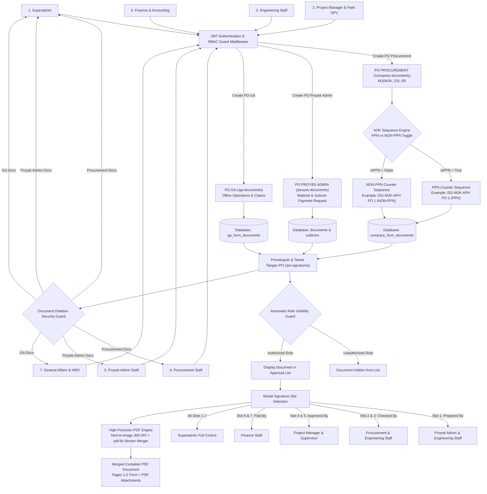
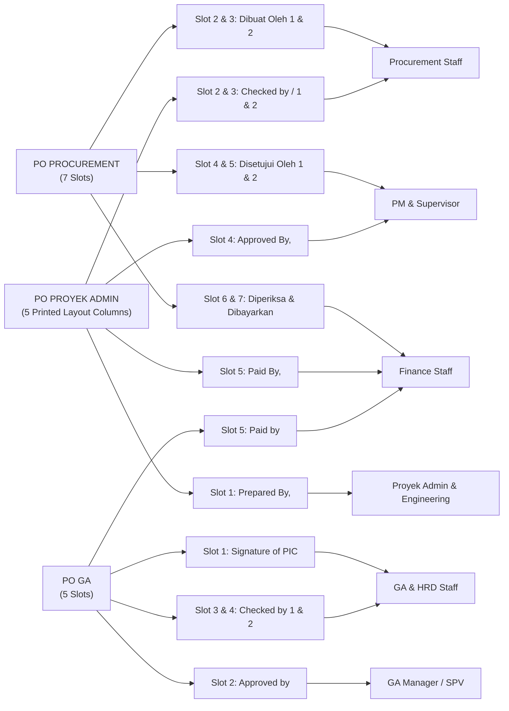
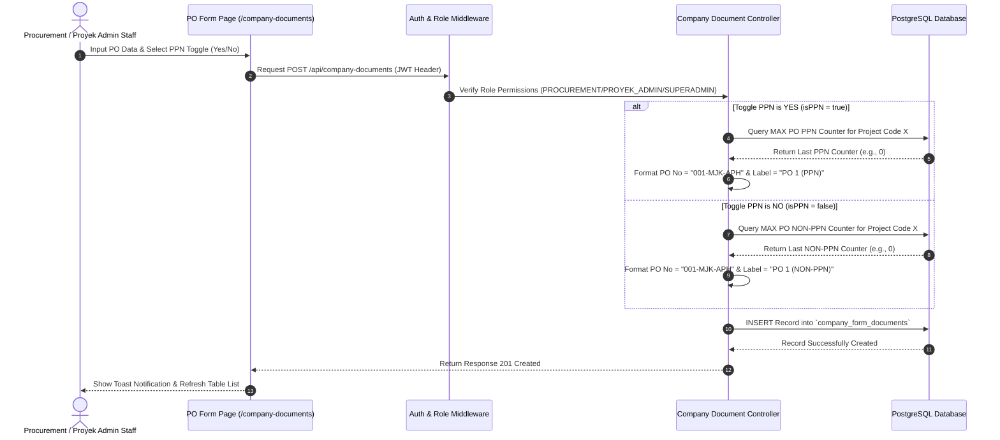

# Advanced Technical Documentation, System Flowmaps & Relational DDL Schemas
### PT. MODERN JAYA KONSTRUKSI — Enterprise ERP System

> **Document Type:** System Architecture & Data Flow Specification  
> **Version:** 3.5.0-PROD  
> **Date:** August 8, 2026  

---

## 1. Master System Flowmap (End-to-End Enterprise Architecture)

### A. End-to-End Master Operational Flowmap



---

### B. Precision Signature Slot Mapping Flowchart (1-to-1 Mapping)



---

## 2. Sequence Diagram: PPN vs NON-PPN PO Numbering Engine

The system executes custom logic ensuring PPN and NON-PPN PO counters operate independently without number collision:



---

## 3. Digital Signature Routing & 1-to-1 Slot Mapping

To guarantee signatures align perfectly with document template columns, signature slots map 1-to-1:

### A. PO PROCUREMENT Module (`/company-documents`) — 7 Signature Slots
- **Slot 2 (`Dibuat Oleh 1`)**: Staff Procurement (*Glori, Via, Salsa, Zein, Fanisa*)
- **Slot 3 (`Dibuat Oleh 2`)**: Staff Procurement (*Glori, Via, Salsa, Zein, Fanisa*)
- **Slot 4 (`Disetujui Oleh 1`)**: Project Manager & Supervisor (*Edi Purwanto, Edi, Joko, Lucas, Dwi*)
- **Slot 5 (`Disetujui Oleh 2`)**: Project Manager & Supervisor (*Edi Purwanto, Edi, Joko, Lucas, Dwi*)
- **Slot 6 (`Diperiksa Oleh`)**: Finance Staff (*Fitri, Rachel, Kiki, Dian, Yunita*)
- **Slot 7 (`Dibayarkan Oleh`)**: Finance Staff (*Rachel, Fitri, Kiki, Dian, Yunita*)

### B. PO PROYEK ADMIN Module (`/proyek-documents`) — 5 Printed Layout Columns
- **Slot 1 (`Prepared By,`)**: Proyek Admin & Engineering (*Arnis, Denny, Dhea, Lucas*)
- **Slot 2 (`Checked by / 1`)**: Procurement Staff (*Glori, Via, Salsa*)
- **Slot 3 (`Checked by / 2`)**: Procurement & Engineering Staff
- **Slot 4 (`Approved By,`)**: Project Manager & Supervisor (*Edi Purwanto, Edi*)
- **Slot 5 (`Paid By,`)**: Finance Staff (*Rachel, Fitri, Dian*)

### C. PO GA Module (`/ga-documents`) — 5 Signature Slots
- **Slot 1 (`Signature of PIC`)**: Staff GA / HRD
- **Slot 2 (`Approved by`)**: GA Manager / Supervisor / HRD
- **Slot 3 & 4 (`Checked by 1 & 2`)**: GA & Finance Staff
- **Slot 5 (`Paid by`)**: Finance Staff (*Rachel, Fitri*)

---

## 4. Subcontractor 24-Column Matrix & Finance 19-Column Matrix

### A. Subcontractor 2 Operational Matrix (24 Columns)
1. `No` — Row index
2. `Subcon Name` — Subcontractor vendor name
3. `Work Scope` — Description of work items
4. `Subcon SPK No` — Subcontractor contract number
5. `Contract Value` — Initial contract value
6. `Addendum / VO` — Variation Order value adjustment
7. `Final Contract Total` — Initial Value + Addendums
8. `Term 1 (DP)` — Down payment amount
9. `Term 2 (Progress 1)` — Progress payment 1
10. `Term 3 (Progress 2)` — Progress payment 2
11. `Term 4 (Retention)` — Retention payment amount
12. `Total Subcon Invoiced` — Total billed amount to date
13. `Remaining Balance` — Remaining contract balance
14. `Payment Status` — Paid / Outstanding badge
15. `Tax Invoice` — Tax invoice reference & file
16. `BAST Receipt` — Handover receipt file
17. `Progress Remarks` — Field progress notes
18. `SPK File` — Uploaded PDF SPK Contract
19. `Invoice File` — Uploaded PDF Vendor Invoice
20. `Tax File` — Uploaded PDF Tax Certificate
21. `Submission Date` — Invoice submission date
22. `Paid Date` — Actual payment date
23. `PIC Verifier` — Staff verifier name
24. `Revision Notes` — Revision notes

### B. Finance Cashflow Matrix (19 Columns)
1. `Project Code` — Unique project identifier
2. `Client Name` — Client company name
3. `Project Name` — Construction project title
4. `Contract Value` — Total contract value
5. `Contract Start` — Commencement date
6. `Timeline` — Execution duration
7. `Contract End` — Completion target date
8. `Project Status` — Running / Finished / Maintenance
9. `Physical Progress (%)` — Physical progress percentage
10. `Total BOQ` — Allocated BOQ budget
11. `Total Invoice` — Cumulative invoices issued
12. `Term` — Billing stage
13. `Term Value` — Invoice stage amount
14. `PPH (%)` — Income Tax deduction percentage
15. `Grand Total (Nett)` — Net payment payable
16. `Billing Status` — Outstanding / Paid / Partial
17. `Remarks` — Finance admin notes
18. `Field Issues` — Billing bottlenecks
19. `Payment Remarks` — Bank transaction reference

---

## 5. PostgreSQL DDL Relational Database Schema

```sql
-- PostgreSQL DDL for PT. Modern Jaya Konstruksi ERP System

CREATE TYPE "Role" AS ENUM (
  'SUPERADMIN',
  'PROJECT_MANAGER',
  'SUPERVISOR',
  'ENGINEERING',
  'PROCUREMENT',
  'PROYEK_ADMIN',
  'FINANCE',
  'GA',
  'STAFF_GA',
  'HRD'
);

CREATE TABLE "User" (
  "id" VARCHAR(36) PRIMARY KEY DEFAULT gen_random_uuid(),
  "email" VARCHAR(255) UNIQUE NOT NULL,
  "name" VARCHAR(255) NOT NULL,
  "password" VARCHAR(255) NOT NULL,
  "role" "Role" NOT NULL DEFAULT 'PROYEK_ADMIN',
  "managerId" VARCHAR(36),
  "createdAt" TIMESTAMP NOT NULL DEFAULT CURRENT_TIMESTAMP,
  "updatedAt" TIMESTAMP NOT NULL DEFAULT CURRENT_TIMESTAMP
);

CREATE TABLE "Project" (
  "id" VARCHAR(36) PRIMARY KEY DEFAULT gen_random_uuid(),
  "kodeProyek" VARCHAR(100) UNIQUE NOT NULL,
  "namaProyek" VARCHAR(255) NOT NULL,
  "namaClient" VARCHAR(255) NOT NULL,
  "nilaiKontrak" DOUBLE PRECISION NOT NULL,
  "awalKontrak" TIMESTAMP,
  "akhirKontrak" TIMESTAMP,
  "status" VARCHAR(50) NOT NULL DEFAULT 'Running',
  "createdAt" TIMESTAMP NOT NULL DEFAULT CURRENT_TIMESTAMP,
  "updatedAt" TIMESTAMP NOT NULL DEFAULT CURRENT_TIMESTAMP
);

CREATE TABLE "CompanyFormDocument" (
  "id" VARCHAR(36) PRIMARY KEY DEFAULT gen_random_uuid(),
  "company" VARCHAR(100) NOT NULL,
  "documentNo" VARCHAR(255) UNIQUE NOT NULL,
  "poNo" VARCHAR(255),
  "vendorName" VARCHAR(255),
  "documentData" JSONB NOT NULL,
  "signatures" JSONB,
  "status" VARCHAR(50) NOT NULL DEFAULT 'PENDING',
  "createdAt" TIMESTAMP NOT NULL DEFAULT CURRENT_TIMESTAMP,
  "updatedAt" TIMESTAMP NOT NULL DEFAULT CURRENT_TIMESTAMP
);

CREATE TABLE "GaFormDocument" (
  "id" VARCHAR(36) PRIMARY KEY DEFAULT gen_random_uuid(),
  "company" VARCHAR(100) NOT NULL,
  "documentNo" VARCHAR(255) UNIQUE NOT NULL,
  "documentData" JSONB NOT NULL,
  "signatures" JSONB,
  "status" VARCHAR(50) NOT NULL DEFAULT 'PENDING',
  "createdAt" TIMESTAMP NOT NULL DEFAULT CURRENT_TIMESTAMP,
  "updatedAt" TIMESTAMP NOT NULL DEFAULT CURRENT_TIMESTAMP
);

CREATE TABLE "Document" (
  "id" VARCHAR(36) PRIMARY KEY DEFAULT gen_random_uuid(),
  "projectId" VARCHAR(36) NOT NULL REFERENCES "Project"("id") ON DELETE CASCADE,
  "code" VARCHAR(100) NOT NULL,
  "name" VARCHAR(255) NOT NULL,
  "filePath" TEXT NOT NULL,
  "fileType" VARCHAR(50) NOT NULL,
  "fileSize" Int NOT NULL,
  "createdById" VARCHAR(36),
  "createdAt" TIMESTAMP NOT NULL DEFAULT CURRENT_TIMESTAMP,
  "updatedAt" TIMESTAMP NOT NULL DEFAULT CURRENT_TIMESTAMP
);

CREATE TABLE "Subkon" (
  "id" VARCHAR(36) PRIMARY KEY DEFAULT gen_random_uuid(),
  "projectId" VARCHAR(36) NOT NULL REFERENCES "Project"("id") ON DELETE CASCADE,
  "namaSubkon" VARCHAR(255) NOT NULL,
  "pekerjaan" TEXT NOT NULL,
  "noSpk" VARCHAR(255),
  "nilaiKontrak" DOUBLE PRECISION NOT NULL,
  "createdAt" TIMESTAMP NOT NULL DEFAULT CURRENT_TIMESTAMP,
  "updatedAt" TIMESTAMP NOT NULL DEFAULT CURRENT_TIMESTAMP
);

CREATE TABLE "SubkonTermin" (
  "id" VARCHAR(36) PRIMARY KEY DEFAULT gen_random_uuid(),
  "subkonId" VARCHAR(36) NOT NULL REFERENCES "Subkon"("id") ON DELETE CASCADE,
  "namaTermin" VARCHAR(255) NOT NULL,
  "nilaiTermin" DOUBLE PRECISION NOT NULL,
  "status" VARCHAR(50) NOT NULL DEFAULT 'PENDING',
  "createdAt" TIMESTAMP NOT NULL DEFAULT CURRENT_TIMESTAMP,
  "updatedAt" TIMESTAMP NOT NULL DEFAULT CURRENT_TIMESTAMP
);

-- Indexing for Maximum Performance
CREATE INDEX "idx_user_email" ON "User"("email");
CREATE INDEX "idx_project_kodeproyek" ON "Project"("kodeProyek");
CREATE INDEX "idx_company_docno" ON "CompanyFormDocument"("documentNo");
CREATE INDEX "idx_company_status" ON "CompanyFormDocument"("status");
CREATE INDEX "idx_document_projectid" ON "Document"("projectId");
CREATE INDEX "idx_subkon_projectid" ON "Subkon"("projectId");
```

---

## 6. User Role Authorization Matrix (7 Divisions + Superadmin)

| Division / Role | PO Signatures Access (`/po-signatures`) | PO Form Access | Deletion Authority | Explorer & Core Feature Access |
| --- | --- | --- | --- | --- |
| **SUPERADMIN** | Slot 1 - 7 (Full Authority) | All PO Forms | All Documents | Full CRUD, User Management, Audit Logs, System Settings |
| **PROJECT_MANAGER** | Slot 4 & 5 (Approved By) | View & Verify | Restricted | BOQ Authorization, Project Progress Tracking, Work Reports |
| **SUPERVISOR** | Slot 4 & 5 (Approved By) | View & Verify | Restricted | Physical Progress Verification, Field Form Approvals |
| **ENGINEERING** | Slot 1 & 3 (Prepared / Checked) | Restricted | Restricted | Global Explorer File Search, C1 Drawings, A1 Client SPK, C3 RAB |
| **PROCUREMENT** | Slot 2 & 3 (Dibuat / Checked) | PO Procurement Form | Procurement Docs | C5 BOQ Rate Evaluation, PO Procurement Form, RFQ Matrix |
| **PROYEK_ADMIN** | Slot 1 (Prepared By) | PO Proyek Admin Form | Proyek Admin Docs | PO Proyek Admin Form, Subcon Tracking Matrix (24 Columns) |
| **FINANCE** | Slot 5, 6, 7 (Diperiksa / Paid) | View & Payment | Restricted | Finance Dashboard (19 Columns), Payment Release, Payment Proof Upload |
| **GA / HRD** | Slot 1, 3, 4, 5 (GA PO) | PO GA Form | GA Docs | PO GA Form (`/ga-documents`), GPS Geotagging Attendance, Daily Work Reports |

---

© 2026 **PT. Modern Jaya Konstruksi** — Enterprise Digital Construction ERP System. All Rights Reserved.
