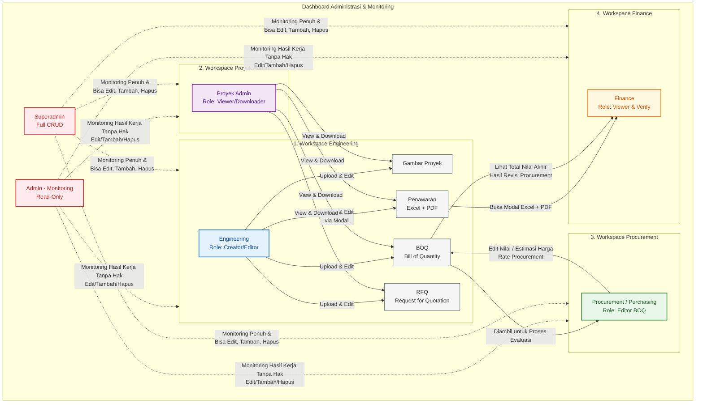

# 🗺️ Flowmap & Spesifikasi Database: Sistem Manajemen Dokumen Proyek

Dokumen ini mendefinisikan alur kerja kolaborasi proyek, struktur folder penyimpanan file pengguna yang terisolasi, rancangan skema database relasional menggunakan Prisma ORM dan SQL PostgreSQL, serta spesifikasi detail untuk mengimpor data dari file Excel (Penawaran, BOQ, dan RFQ).

---

## 1. Flowmap Alur Kerja Proyek

Berdasarkan alur kerja yang diberikan pada sketsa gambar, berikut adalah visualisasi proses bisnis menggunakan **Mermaid Diagram**:



### Penjelasan Alur Kerja:
1. **Engineering**: Memulai alur kerja dengan mengupload dan mengedit berkas proyek utama, yaitu:
   * **Gambar**: Desain gambar teknis proyek.
   * **Penawaran**: Berkas komersial dari vendor (format Excel + PDF) yang diupload menggunakan antarmuka Modal.
   * **BOQ (Bill of Quantity)**: Rincian volume dan estimasi harga pekerjaan.
   * **RFQ (Request for Quotation)**: Permintaan penawaran ke vendor.
2. **Proyek Admin**: Bertindak sebagai pengendali administrasi lapangan yang dapat **melihat (View)** dan **mengunduh (Download)** seluruh berkas yang diupload oleh Engineering untuk keperluan koordinasi atau arsip fisik.
3. **Procurement / Purchasing**: Mengambil file **BOQ** dari Engineering dan memiliki hak akses khusus untuk **mengedit (Edit)** detail harga satuan realisasi (Rate Procurement) sebelum diajukan ke tahap pembayaran.
4. **Finance**: Melakukan verifikasi akhir dengan **melihat (View)** berkas **Penawaran** melalui modal (Excel + PDF) dan **melihat total nilai akhir (Total)** dari BOQ yang telah disesuaikan oleh Procurement.
5. **Admin (Monitoring)**: Staf manajemen yang memantau riwayat perubahan dan hasil kerja seluruh user (Read-Only).
6. **Superadmin**: Akun pemilik sistem dengan hak penuh untuk melakukan CRUD (Create, Read, Update, Delete) pada seluruh data transaksi dan manajemen user.

---

## 2. Struktur Folder Penyimpanan File (User Folder Isolation)

Untuk memenuhi kebutuhan **"setiap user memiliki folder masing-masing"**, penyimpanan fisik berkas di server diisolasi berdasarkan ID unik pengguna (`user_id`). 

Berikut adalah struktur folder penyimpanan pada server/cloud storage (misal di folder `/uploads`):

```text
storage/
└── uploads/
    └── users/
        ├── {user_uuid_1}/               # Folder khusus User 1
        │   ├── gambar/                  # File gambar teknis (.dwg, .pdf, .png)
        │   │   ├── site-plan-v1.pdf
        │   │   └── detail-pondasi.dwg
        │   ├── penawaran/               # Dokumen penawaran vendor (.xlsx, .pdf)
        │   │   ├── penawaran-vendor-a.xlsx
        │   │   └── penawaran-vendor-a.pdf
        │   ├── boq/                     # Dokumen Bill of Quantity (.xlsx)
        │   │   └── boq-initial.xlsx
        │   └── rfq/                     # Dokumen Request for Quotation (.xlsx, .docx)
        │       └── rfq-semen-padang.xlsx
        │
        ├── {user_uuid_2}/               # Folder khusus User 2
        │   ├── gambar/
        │   ├── penawaran/
        │   ├── boq/
        │   └── rfq/
        │
        └── temp_import/                 # Folder sementara untuk parsing Excel
```

> [!IMPORTANT]
> **Kebijakan Keamanan Folder (Security Policy)**:
> 1. Secara fisik, file disimpan dalam direktori terisolasi menggunakan `userId` sebagai nama folder.
> 2. Di level aplikasi (Express.js), middleware autentikasi akan membatasi agar user biasa hanya dapat menulis (`write`) ke dalam folder dengan `userId` mereka sendiri.
> 3. Pengaksesan file oleh role lain (misal Proyek Admin melihat file Engineering) divalidasi melalui endpoint API (seperti `/api/files/download/:fileId`) yang memverifikasi kecocokan hak akses berdasarkan role di database sebelum mengirimkan file (tidak diekspos secara publik/static folder bypass).

---

## 3. Skema Database (Database Schema)

Berikut rancangan skema database relasional yang mendukung multi-role (termasuk Admin Monitoring & Superadmin), pencatatan file, isolasi folder, serta penyimpanan detail data Excel.

### A. Kode Skema Prisma ORM (`schema.prisma`)

```prisma
datasource db {
  provider = "postgresql"
  url      = env("DATABASE_URL")
}

generator client {
  provider = "prisma-client-js"
}

// Definisikan Role User sesuai kebutuhan sistem
enum Role {
  ENGINEERING
  PROYEK_ADMIN
  PROCUREMENT
  FINANCE
  ADMIN_MONITORING   // Hanya bisa monitoring (Read-Only)
  SUPERADMIN         // Bisa monitoring + CRUD
}

// Jenis dokumen yang diupload
enum DocType {
  GAMBAR
  PENAWARAN
  BOQ
  RFQ
}

// Status persetujuan/proses dokumen
enum DocStatus {
  DRAFT
  PENDING
  REVISED_BY_PROCUREMENT
  APPROVED
  REJECTED
}

// 1. Model Pengguna (User)
model User {
  id           String        @id @default(uuid())
  name         String
  email        String        @unique
  passwordHash String        @map("password_hash")
  role         Role          @default(ENGINEERING)
  createdAt    DateTime      @default(now()) @map("created_at")
  updatedAt    DateTime      @updatedAt @map("updated_at")
  
  // Relasi
  folders      UserFolder[]  // Manajemen folder fisik user
  documents    Document[]    // Dokumen yang diupload oleh user ini
  auditLogs    AuditLog[]    // Jejak audit aktivitas user

  @@map("users")
}

// 2. Model Folder Pengguna (User Folder Path Mapping)
model UserFolder {
  id        String   @id @default(uuid())
  userId    String   @map("user_id")
  user      User     @relation(fields: [userId], references: [id], onDelete: Cascade)
  folderPath String   @unique @map("folder_path") // Path fisik e.g., "storage/uploads/users/usr-uuid"
  createdAt DateTime @default(now()) @map("created_at")

  @@map("user_folders")
}

// 3. Model Proyek (Project Container)
model Project {
  id          String     @id @default(uuid())
  name        String
  description String?
  createdAt   DateTime   @default(now()) @map("created_at")
  documents   Document[]

  @@map("projects")
}

// 4. Model Metadata File (Document)
model Document {
  id           String      @id @default(uuid())
  projectId    String      @map("project_id")
  project      Project     @relation(fields: [projectId], references: [id], onDelete: Cascade)
  fileName     String      @map("file_name")
  fileType     DocType     @map("file_type")
  filePath     String      @map("file_path")      // Lokasi file fisik di folder user
  fileSize     Int         @map("file_size")      // Ukuran file dalam bytes
  uploadedById String      @map("uploaded_by_id")
  uploadedBy   User        @relation(fields: [uploadedById], references: [id], onDelete: Restrict)
  status       DocStatus   @default(DRAFT)
  createdAt    DateTime    @default(now()) @map("created_at")
  updatedAt    DateTime    @updatedAt @map("updated_at")

  // Relasi ke Data hasil parsing Excel
  boqHeaders       BoqHeader[]
  penawaranHeaders PenawaranHeader[]
  rfqHeaders       RfqHeader[]

  @@map("documents")
}

// ==========================================
// DATA DARI EXCEL (PARSED SHEET DATA MODELS)
// ==========================================

// 5. BOQ (Bill of Quantity) - Header
model BoqHeader {
  id          String      @id @default(uuid())
  documentId  String      @map("document_id")
  document    Document    @relation(fields: [documentId], references: [id], onDelete: Cascade)
  totalAmount Float       @default(0) @map("total_amount") // Total Kalkulasi Akhir
  createdAt   DateTime    @default(now()) @map("created_at")
  updatedAt   DateTime    @updatedAt @map("updated_at")
  items       BoqItem[]

  @@map("boq_headers")
}

// 6. BOQ (Bill of Quantity) - Detail/Item
model BoqItem {
  id                 String    @id @default(uuid())
  boqHeaderId        String    @map("boq_header_id")
  boqHeader          BoqHeader @relation(fields: [boqHeaderId], references: [id], onDelete: Cascade)
  wbsCode            String?   @map("wbs_code") // Code struktur pekerjaan
  description        String
  quantity           Float
  unit               String    // e.g., "m3", "kg", "pcs"
  rateEngineering    Float     @map("rate_engineering") // Harga estimasi awal dari Engineering
  rateProcurement    Float     @map("rate_procurement") // Harga revisi dari Procurement
  totalPrice         Float     @map("total_price")      // qty * rateProcurement (atau rateEng jika kosong)
  notes              String?
  createdAt          DateTime  @default(now()) @map("created_at")
  updatedAt          DateTime  @updatedAt @map("updated_at")

  @@map("boq_items")
}

// 7. Penawaran (Quotation Vendor) - Header
model PenawaranHeader {
  id          String          @id @default(uuid())
  documentId  String          @map("document_id")
  document    Document        @relation(fields: [documentId], references: [id], onDelete: Cascade)
  vendorName  String          @map("vendor_name")
  quoteNumber String?         @map("quote_number")
  totalOffer  Float           @map("total_offer")
  validityDate DateTime?      @map("validity_date")
  createdAt   DateTime        @default(now()) @map("created_at")
  items       PenawaranItem[]

  @@map("penawaran_headers")
}

// 8. Penawaran (Quotation Vendor) - Detail/Item
model PenawaranItem {
  id                String          @id @default(uuid())
  penawaranHeaderId String          @map("penawaran_header_id")
  penawaranHeader   PenawaranHeader @relation(fields: [penawaranHeaderId], references: [id], onDelete: Cascade)
  itemNo            Int             @map("item_no")
  description       String
  quantity          Float
  unit              String
  unitPrice         Float           @map("unit_price")
  totalPrice        Float           @map("total_price") // qty * unitPrice
  notes             String?

  @@map("penawaran_items")
}

// 9. RFQ (Request for Quotation) - Header
model RfqHeader {
  id          String    @id @default(uuid())
  documentId  String    @map("document_id")
  document    Document  @relation(fields: [documentId], references: [id], onDelete: Cascade)
  rfqNumber   String    @unique @map("rfq_number")
  targetDate  DateTime? @map("target_date")
  terms       String?
  createdAt   DateTime  @default(now()) @map("created_at")
  items       RfqItem[]

  @@map("rfq_headers")
}

// 10. RFQ (Request for Quotation) - Detail/Item
model RfqItem {
  id             String    @id @default(uuid())
  rfqHeaderId    String    @map("rfq_header_id")
  rfqHeader      RfqHeader @relation(fields: [rfqHeaderId], references: [id], onDelete: Cascade)
  itemNo         Int       @map("item_no")
  description    String
  quantity       Float
  unit           String
  specifications String?
  notes          String?

  @@map("rfq_items")
}

// 11. Audit Log (Untuk Monitoring Kerja User oleh Admin & Superadmin)
model AuditLog {
  id          String   @id @default(uuid())
  userId      String?  @map("user_id")
  user        User?    @relation(fields: [userId], references: [id], onDelete: SetNull)
  actionType  String   @map("action_type") // e.g., "UPLOAD_FILE", "EDIT_BOQ", "DOWNLOAD_FILE", "DELETE_USER"
  tableName   String   @map("table_name")  // e.g., "documents", "boq_items"
  recordId    String   @map("record_id")
  description String
  oldValues   String?  @map("old_values")  // JSON String sebelum diubah (untuk tracking edit Superadmin)
  newValues   String?  @map("new_values")  // JSON String sesudah diubah
  ipAddress   String?  @map("ip_address")
  timestamp   DateTime @default(now())

  @@map("audit_logs")
}
```

---

### B. Kode DDL SQL (PostgreSQL Native Script)

Jika ingin melakukan inisialisasi skema database secara langsung menggunakan SQL:

```sql
-- DDL Script PostgreSQL

-- 1. Create Enums
CREATE TYPE "Role" AS ENUM (
  'ENGINEERING', 
  'PROYEK_ADMIN', 
  'PROCUREMENT', 
  'FINANCE', 
  'ADMIN_MONITORING', 
  'SUPERADMIN'
);

CREATE TYPE "DocType" AS ENUM (
  'GAMBAR', 
  'PENAWARAN', 
  'BOQ', 
  'RFQ'
);

CREATE TYPE "DocStatus" AS ENUM (
  'DRAFT', 
  'PENDING', 
  'REVISED_BY_PROCUREMENT', 
  'APPROVED', 
  'REJECTED'
);

-- 2. Create Users Table
CREATE TABLE users (
    id UUID PRIMARY KEY DEFAULT gen_random_uuid(),
    name VARCHAR(255) NOT NULL,
    email VARCHAR(255) UNIQUE NOT NULL,
    password_hash VARCHAR(255) NOT NULL,
    role "Role" DEFAULT 'ENGINEERING' NOT NULL,
    created_at TIMESTAMP WITH TIME ZONE DEFAULT CURRENT_TIMESTAMP,
    updated_at TIMESTAMP WITH TIME ZONE DEFAULT CURRENT_TIMESTAMP
);

-- 3. Create User Folders Table
CREATE TABLE user_folders (
    id UUID PRIMARY KEY DEFAULT gen_random_uuid(),
    user_id UUID NOT NULL REFERENCES users(id) ON DELETE CASCADE,
    folder_path VARCHAR(512) UNIQUE NOT NULL,
    created_at TIMESTAMP WITH TIME ZONE DEFAULT CURRENT_TIMESTAMP
);

-- 4. Create Projects Table
CREATE TABLE projects (
    id UUID PRIMARY KEY DEFAULT gen_random_uuid(),
    name VARCHAR(255) NOT NULL,
    description TEXT,
    created_at TIMESTAMP WITH TIME ZONE DEFAULT CURRENT_TIMESTAMP
);

-- 5. Create Documents Table
CREATE TABLE documents (
    id UUID PRIMARY KEY DEFAULT gen_random_uuid(),
    project_id UUID NOT NULL REFERENCES projects(id) ON DELETE CASCADE,
    file_name VARCHAR(255) NOT NULL,
    file_type "DocType" NOT NULL,
    file_path VARCHAR(512) NOT NULL,
    file_size INT NOT NULL,
    uploaded_by_id UUID NOT NULL REFERENCES users(id) ON DELETE RESTRICT,
    status "DocStatus" DEFAULT 'DRAFT' NOT NULL,
    created_at TIMESTAMP WITH TIME ZONE DEFAULT CURRENT_TIMESTAMP,
    updated_at TIMESTAMP WITH TIME ZONE DEFAULT CURRENT_TIMESTAMP
);

-- 6. Create BOQ Headers Table
CREATE TABLE boq_headers (
    id UUID PRIMARY KEY DEFAULT gen_random_uuid(),
    document_id UUID NOT NULL REFERENCES documents(id) ON DELETE CASCADE,
    total_amount DOUBLE PRECISION DEFAULT 0.0 NOT NULL,
    created_at TIMESTAMP WITH TIME ZONE DEFAULT CURRENT_TIMESTAMP,
    updated_at TIMESTAMP WITH TIME ZONE DEFAULT CURRENT_TIMESTAMP
);

-- 7. Create BOQ Items Table
CREATE TABLE boq_items (
    id UUID PRIMARY KEY DEFAULT gen_random_uuid(),
    boq_header_id UUID NOT NULL REFERENCES boq_headers(id) ON DELETE CASCADE,
    wbs_code VARCHAR(100),
    description TEXT NOT NULL,
    quantity DOUBLE PRECISION NOT NULL,
    unit VARCHAR(50) NOT NULL,
    rate_engineering DOUBLE PRECISION NOT NULL,
    rate_procurement DOUBLE PRECISION NOT NULL,
    total_price DOUBLE PRECISION NOT NULL,
    notes TEXT,
    created_at TIMESTAMP WITH TIME ZONE DEFAULT CURRENT_TIMESTAMP,
    updated_at TIMESTAMP WITH TIME ZONE DEFAULT CURRENT_TIMESTAMP
);

-- 8. Create Penawaran Headers Table
CREATE TABLE penawaran_headers (
    id UUID PRIMARY KEY DEFAULT gen_random_uuid(),
    document_id UUID NOT NULL REFERENCES documents(id) ON DELETE CASCADE,
    vendor_name VARCHAR(255) NOT NULL,
    quote_number VARCHAR(100),
    total_offer DOUBLE PRECISION NOT NULL,
    validity_date DATE,
    created_at TIMESTAMP WITH TIME ZONE DEFAULT CURRENT_TIMESTAMP
);

-- 9. Create Penawaran Items Table
CREATE TABLE penawaran_items (
    id UUID PRIMARY KEY DEFAULT gen_random_uuid(),
    penawaran_header_id UUID NOT NULL REFERENCES penawaran_headers(id) ON DELETE CASCADE,
    item_no INT NOT NULL,
    description TEXT NOT NULL,
    quantity DOUBLE PRECISION NOT NULL,
    unit VARCHAR(50) NOT NULL,
    unit_price DOUBLE PRECISION NOT NULL,
    total_price DOUBLE PRECISION NOT NULL,
    notes TEXT
);

-- 10. Create RFQ Headers Table
CREATE TABLE rfq_headers (
    id UUID PRIMARY KEY DEFAULT gen_random_uuid(),
    document_id UUID NOT NULL REFERENCES documents(id) ON DELETE CASCADE,
    rfq_number VARCHAR(100) UNIQUE NOT NULL,
    target_date DATE,
    terms TEXT,
    created_at TIMESTAMP WITH TIME ZONE DEFAULT CURRENT_TIMESTAMP
);

-- 11. Create RFQ Items Table
CREATE TABLE rfq_items (
    id UUID PRIMARY KEY DEFAULT gen_random_uuid(),
    rfq_header_id UUID NOT NULL REFERENCES rfq_headers(id) ON DELETE CASCADE,
    item_no INT NOT NULL,
    description TEXT NOT NULL,
    quantity DOUBLE PRECISION NOT NULL,
    unit VARCHAR(50) NOT NULL,
    specifications TEXT,
    notes TEXT
);

-- 12. Create Audit Logs Table
CREATE TABLE audit_logs (
    id UUID PRIMARY KEY DEFAULT gen_random_uuid(),
    user_id UUID REFERENCES users(id) ON DELETE SET NULL,
    action_type VARCHAR(100) NOT NULL,
    table_name VARCHAR(100) NOT NULL,
    record_id VARCHAR(100) NOT NULL,
    description TEXT NOT NULL,
    old_values TEXT, -- Data JSON sebelum diubah
    new_values TEXT, -- Data JSON setelah diubah
    ip_address VARCHAR(45),
    timestamp TIMESTAMP WITH TIME ZONE DEFAULT CURRENT_TIMESTAMP
);
```

---

## 4. Pemetaan Struktur Data File Excel

Ketika file Excel diupload oleh Engineering, sistem backend akan mem-parsing lembar kerja Excel dan memetakannya ke kolom database sebagai berikut:

### A. Template BOQ (Bill of Quantity)

*Tabel pemetaan data dari kolom Excel ke kolom database:*

| Kolom Excel | Tipe Data | Kolom Database | Deskripsi | Diisi Oleh |
| :--- | :--- | :--- | :--- | :--- |
| **No WBS / Pos** | `String` | `wbsCode` | Kode WBS/Struktur Pekerjaan (misal: 1.1.a) | Engineering |
| **Deskripsi Pekerjaan** | `Text` | `description` | Rincian pekerjaan fisik yang diestimasi | Engineering |
| **Volume / Qty** | `Float` | `quantity` | Jumlah volume pekerjaan | Engineering |
| **Satuan** | `String` | `unit` | Satuan unit (m3, m2, unit, lot, dll.) | Engineering |
| **Harga Satuan (Eng)** | `Float` | `rateEngineering` | Estimasi harga satuan awal | Engineering |
| **Harga Satuan (Proc)** | `Float` | `rateProcurement` | Harga deal/final hasil negosiasi vendor | Procurement |
| **Total Harga** | `Float` | `totalPrice` | `qty` * `rateProcurement` (atau `rateEngineering`) | Otomatis (System) |
| **Keterangan** | `Text` | `notes` | Keterangan tambahan item | Engineering / Proc |

---

### B. Template Penawaran (Quotation Vendor)

*Diupload menggunakan form/modal yang meminta input nama Vendor dan Tanggal Berlaku, kemudian mem-parse item detail:*

| Kolom Excel / Modal | Tipe Data | Kolom Database | Deskripsi |
| :--- | :--- | :--- | :--- |
| **Nama Vendor (Modal)** | `String` | `vendorName` | Diinput secara manual di modal sebelum upload |
| **No Penawaran (Modal)**| `String` | `quoteNumber` | Nomor dokumen penawaran resmi dari vendor |
| **No Item** | `Int` | `itemNo` | Nomor baris item penawaran |
| **Nama Barang / Jasa** | `Text` | `description` | Spesifikasi barang/jasa yang ditawarkan |
| **Jumlah (Qty)** | `Float` | `quantity` | Kebutuhan kuantitas |
| **Satuan** | `String` | `unit` | Satuan barang (pcs, roll, unit) |
| **Harga Satuan** | `Float` | `unitPrice` | Harga per satuan dari vendor |
| **Total Nilai** | `Float` | `totalPrice` | Hasil perkalian qty * harga satuan |

---

### C. Template RFQ (Request for Quotation)

*Dokumen permintaan penawaran harga kepada vendor:*

| Kolom Excel / Form | Tipe Data | Kolom Database | Deskripsi |
| :--- | :--- | :--- | :--- |
| **Nomor RFQ** | `String` | `rfqNumber` | Nomor surat RFQ resmi (unik) |
| **Target Tanggal** | `Date` | `targetDate` | Tanggal batas pengembalian penawaran |
| **Ketentuan Penyerahan**| `Text` | `terms` | Syarat serah terima & metode pembayaran |
| **No Item** | `Int` | `itemNo` | Nomor baris item barang |
| **Deskripsi Kebutuhan** | `Text` | `description` | Deskripsi barang/jasa yang dibutuhkan |
| **Kuantitas** | `Float` | `quantity` | Kuantitas barang yang diminta |
| **Satuan** | `String` | `unit` | Unit satuan barang |
| **Spesifikasi Detail** | `Text` | `specifications` | Parameter teknis khusus |

---

## 5. Matriks Hak Akses Pengguna (Role-Based Access Control)

Sistem membedakan izin akses berdasarkan peran masing-masing demi menjaga integritas data keuangan dan dokumen.

| Entitas Data / Fitur | Engineering | Proyek Admin | Procurement | Finance | Admin (Monitoring) | Superadmin |
| :--- | :---: | :---: | :---: | :---: | :---: | :---: |
| **Folder User Sendiri** | CRUD | R | R | R | R | CRUD |
| **Folder User Lain** | - | R (Download) | R (Download) | R (Download) | R | CRUD |
| **Gambar Proyek** | CRUD | R (Download) | - | - | R | CRUD |
| **Penawaran (Excel + PDF)** | CRUD | R (Download) | R | R (Modal View) | R | CRUD |
| **BOQ - Rate Engineering** | CRUD | R | R | R | R | CRUD |
| **BOQ - Rate Procurement**| - | R | RU (Edit Rate) | R (Total Only) | R | CRUD |
| **RFQ (Request for Quotation)**| CRUD | R (Download) | R | - | R | CRUD |
| **Manajemen Akun User** | - | - | - | - | - | CRUD |
| **Melihat Log Aktivitas** | - | - | - | - | R (Semua Log) | CRUD |

**Keterangan Simbol:**
* `C` = Create (Tambah Baru)
* `R` = Read / View / Download (Melihat & Mengunduh)
* `U` = Update / Edit (Mengubah Data)
* `D` = Delete (Menghapus Data)
* `-` = Tidak memiliki akses sama sekali

### Perbedaan Utama Level Admin:
1. **Admin (Monitoring)**:
   * **Sifat**: Pasif / Pengawas.
   * **Hak Akses**: Read-only (`R`) pada seluruh log transaksi, data BOQ, penawaran, gambar, dan struktur folder.
   * **Batas Akses**: Tidak memiliki tombol/API endpoint untuk melakukan aksi Edit, Tambah, atau Hapus (`No Write Access`).
2. **Superadmin**:
   * **Sifat**: Aktif / Administrator Utama.
   * **Hak Akses**: Akses penuh (`CRUD`) terhadap database, file fisik, struktur folder user, mengelola akun staff, serta mengubah atau membatalkan data yang salah input oleh staff biasa.
   * **Jejak Audit**: Setiap aksi perubahan yang dilakukan oleh Superadmin wajib tercatat di tabel `audit_logs` untuk menjaga akuntabilitas (menyimpan nilai sebelum vs sesudah perubahan).
